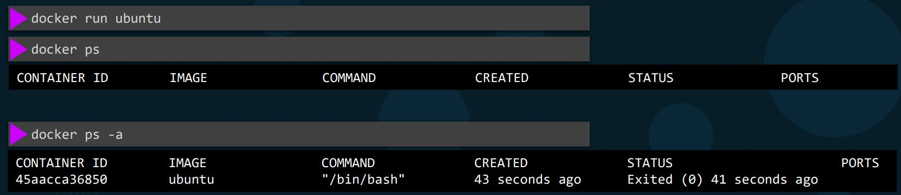

# Basic Docker Commands

<b>RUN</b> - Start a Container

if docker can't find the image locally, it pull from docker hub. This is done for first time
```
docker run nginx
```

<b>RUN</b> - attach and detach
```
docker run kodekloud/simple-webapp -> launch a web server alway listen
docker run -d kodekloud/simple-webapp -> launch web server in background 
docker attach <container_id> -> attach to forground

```
[More info on RUN](https://docs.docker.com/engine/reference/commandline/run/)

<b>PS</b> - list containers

Each container automatically get a random I.D. and name created by Docker
```
docker ps
docker ps -a
```

<b>STOP</b> - stop a container
```
docker stop <container_name>
```

<b>RM</b> -Remove a container

This remove container but not the image
```
docker rm <container_name>
docker ps -> to verify container remove
```

<b>IMAGES</b> - List Images
```
docker images
```

<b>RMI</b> - Remove Images

Ensure that no container running, before remove the image. Delete all dependent containers to remove image
```
docker rmi nginx
```

<b>PULL</b> - download image
```
docker pull nginx
```

Unlike VM, container are not meant to host operating system. Containers are meant to run a specific task or process such as to host an instance of web server. The container lives as long as the processes in the container is alive.

If the web services inside the container is stopped or a crash then the container exits.

 E.g. follow docker cmd run unbuntu and exit.


Append a command 
```
doccker run ubuntu sleep 5
```

<b>EXEC</b> - execute a command
```
docker exec <container_name> cat /etc/hosts
```

